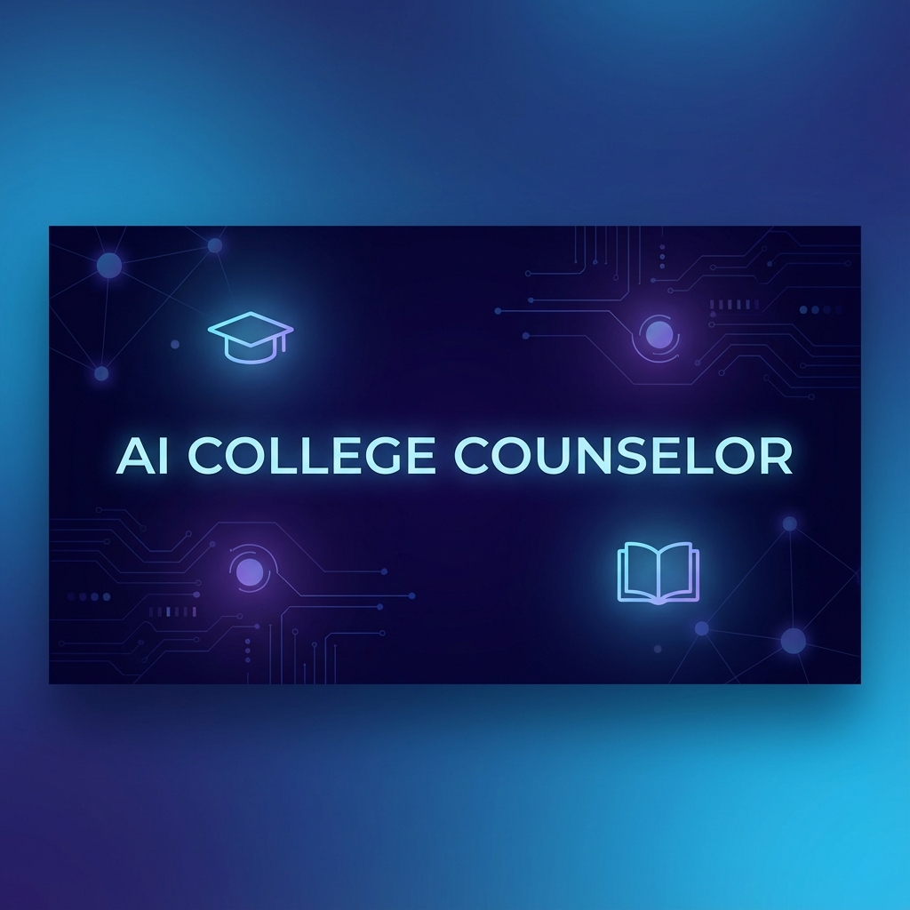

# AI College Counselor

Your personal AI-powered team for navigating the college admissions process.

[](https://ai-college-counselor-v2.vercel.app)

## 🚀 Overview

**AI College Counselor** is a comprehensive multi-agent platform designed to democratize access to high-quality college counseling. By leveraging specialized AI agents, it helps students navigate every aspect of the admissions journey—from finding the perfect school match to crafting compelling essays and securing financial aid.

## ✨ Specialized Agents

The platform features a team of **specialized agents** working in harmony to support high school students:

- **📊 Match Agent**: Analyzes your academic profile (GPA, SAT/ACT) and preferences to recommend tailored *Safety*, *Match*, and *Reach* schools.
- **✍️ Essay Agent**: Provides structural feedback and inspiration for personal statements, helping you tell your unique story.
- **🗺️ Career Path Agent**: Maps your skills, MBTI, and interests to potential college majors and future career trajectories.
- **📈 Progress Agent**: Visualizes your achievement timeline and compares it against successful student profiles to keep you on track.
- **💰 Scholarship Agent**: Scans for financial aid opportunities and scholarships specifically tailored to your background.
- **💼 Internship Agent**: Connects sophomores and juniors with verified high school internship programs and work opportunities in top companies.
- **💸 Financial Aid Agent**: Demystifies the FAFSA, CSS Profile, and financial planning process with AI-guided checklists.
- **🚀 Startups & Competitions Agent**: Curates a list of accelerators, incubators, and prestige competitions for ambitious student entrepreneurs.
- **🤝 Club Agent**: Recommends high-impact club leadership opportunities and initiative ideas to strengthen your extracurricular profile.

## 🛠️ Technology Stack

- **Framework**: [Next.js 16](https://nextjs.org/) (App Router)
- **Language**: TypeScript
- **Styling**: [Tailwind CSS](https://tailwindcss.com/)
- **Icons**: [Lucide React](https://lucide.dev/)
- **Deployment**: [Vercel](https://vercel.com/)

## 🏁 Getting Started

Follow these steps to run the project locally:

1. **Clone the repository**
   ```bash
   git clone https://github.com/Aymc88/Ai-College-Counselor.git
   cd Ai-College-Counselor
   ```

2. **Install dependencies**
   ```bash
   npm install
   ```

3. **Run the development server**
   ```bash
   npm run dev
   ```

4. **Open your browser**
   Navigate to [http://localhost:3000](http://localhost:3000) to launch the AI College Counselor.

## 🚀 Deployment

The easiest way to deploy this app is using **Vercel**, the creators of Next.js.

1. Push your code to your GitHub repository.
2. Go to [Vercel](https://vercel.com) and import your project.
3. Click **Deploy**. Vercel will automatically build and serve your application.

## 📄 License

This project is available for educational and personal use.

---
*Built with ❤️ for the future leaders of tomorrow.*
